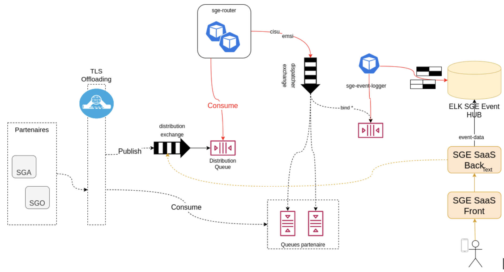

# AMQP version

## Architecture



## Installation

Install Docker and docker-compose (legacy for linux only)

## Run

```bash
make run
make config
```
# SGE endpoints

[Publish](docs/publish.md)

[Elastic](docs/elastic.md)

[RabbitMQ](docs/rabbit.md)

