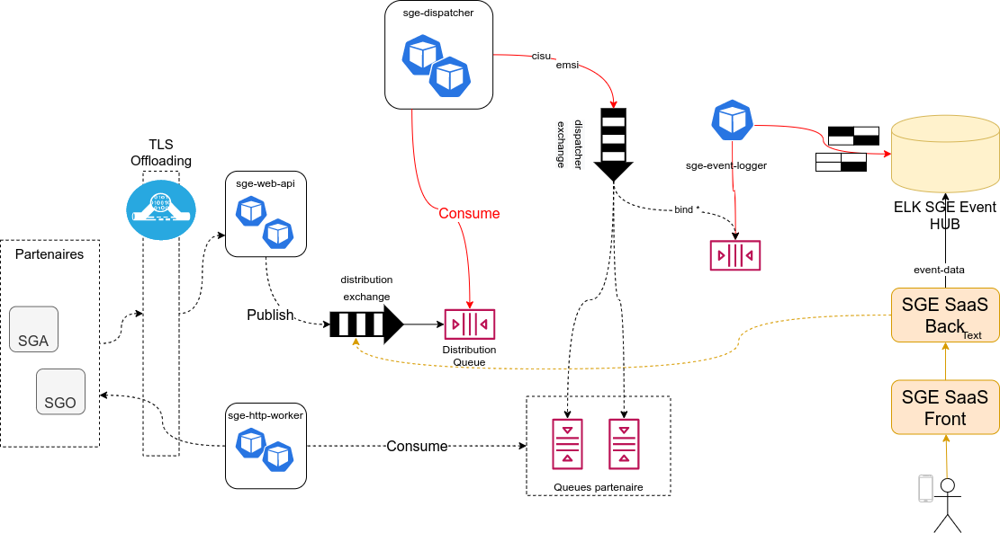

# AMQP version

## Architecture



## Installation

Install Docker and docker-compose (legacy for linux only)

## Run

```bash
make run
make config
```
# SGE endpoints

```bash
ssh root@212.47.251.150 -L 4201:127.0.0.1:4201 -L 8082:127.0.0.1:8082 -L 8081:127.0.0.1:8081 -L 10010:127.0.0.1:10010 -L 8443:127.0.0.1:8443 -L 8083:127.0.0.1:8083 -L 15672:127.0.0.1:15672 -L 9200:127.0.0.1:9200 -L 8888:127.0.0.1:8888 -L 8080:127.0.0.1:8080 -L 4200:127.0.0.1:4200
```

[Publish](docs/publish.md)

[Elastic](docs/elastic.md)

[RabbitMQ](docs/rabbit.md)

# UPDATES

Gérer les erreurs avec le distributionID et messageID  dans le dispatcher et créer les headers 

